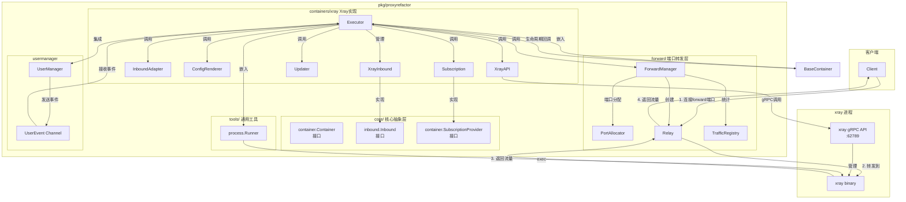
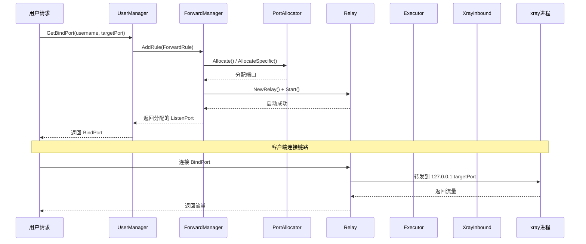
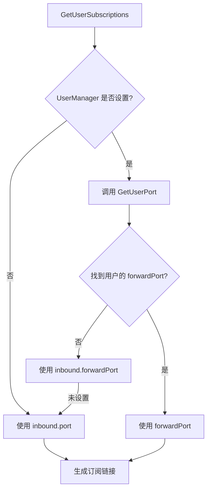
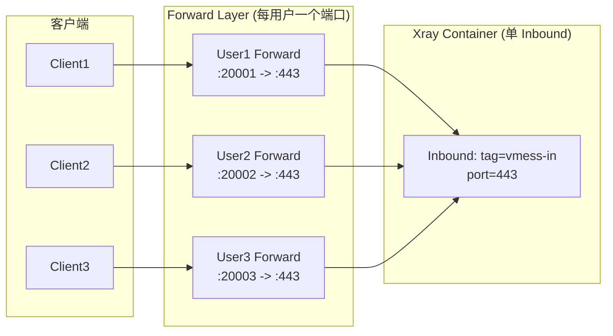
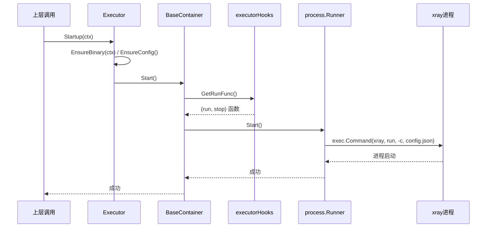
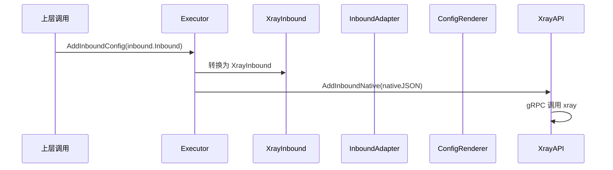
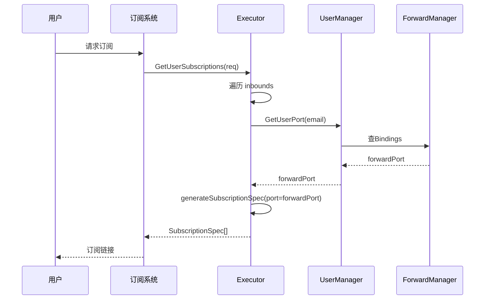

# Xray Container 架构文档

## 概述

本文档描述 v2raymg 项目中 xray container 的架构设计，基于当前代码实现绘制。文档包含架构图、模块说明和关键调用链。

---

## 一、架构总览图



---

## 二、模块职责说明

### 2.1 核心抽象层 (core/)

| 模块 | 文件路径 | 职责 | 状态 |
|------|----------|------|------|
| `container.Container` | `core/container/interface.go` | 定义容器通用接口：Start/Stop/Restart/Reload/IsRunning/Version/Update/Inbound管理/UserManager集成 | ✅ 已实现 |
| `container.BaseContainer` | `core/container/base.go` | 提供容器生命周期状态管理（Stopped/Starting/Running/Stopping），通过 Hooks 回调机制让具体实现控制启动/停止逻辑 | ✅ 已实现 |
| `container.RuntimeAPI` | `core/container/interface.go` | 定义 gRPC 运行时操作：AddInboundNative/RemoveInboundNative/AddUser/RemoveUser/QueryStats | ✅ 已实现 |
| `container.SubscriptionProvider` | `core/container/subscription.go` | 定义订阅链接生成接口 | ✅ 已实现 |
| `inbound.Inbound` | `core/inbound/inbound.go` | 定义通用 inbound 接口：Tag/Protocol/Port/ListenAddr/Config/Extra/ToNative/Validate | ✅ 已实现 |

### 2.2 Xray 具体实现 (containers/xray/)

| 模块 | 文件路径 | 职责 | 状态 |
|------|----------|------|------|
| `Executor` | `containers/xray/exec_runner.go` | Xray 容器实现，嵌入 `BaseContainer` + `process.Runner`，管理 xray 进程生命周期、Inbound 配置、用户端口分配、UserManager 集成 | ✅ 已实现 |
| `XrayInbound` | `containers/xray/exec_runner.go` | Xray 特定的 Inbound 实现，实现 `inbound.Inbound` 接口，存储 xray 原生配置 | ✅ 已实现 |
| `InboundAdapter` | `containers/xray/inbound_adapter.go` | 将领域模型 `contracts.InboundSpec` 转换为 xray 原生 JSON 配置（InboundSpec → NativeInbound） | ✅ 已实现 |
| `ConfigRenderer` | `containers/xray/config_renderer.go` | 将领域模型 `contracts.ContainerModel` 渲染为完整的 xray 原生 JSON 配置文件 | ✅ 已实现 |
| `XrayAPI` | `containers/xray/grpc_client.go` | 通过 gRPC 与运行中的 xray 进程通信，支持运行时添加/删除 inbound、用户、查询流量统计 | ✅ 已实现 |
| `Updater` | `containers/xray/updater.go` | 自动更新 xray 二进制：下载、校验、原子替换、回滚 | ✅ 已实现 |
| `Subscription` | `containers/xray/subscription.go` | 生成用户订阅链接（VLESS/VMess/Trojan/Shadowsocks/SOCKS5），支持 forward 端口映射 | ✅ 已实现 |

### 2.3 用户管理 (usermanager/)

| 模块 | 文件路径 | 职责 | 状态 |
|------|----------|------|------|
| `UserManager` | `usermanager/usermanager.go` | 用户 CRUD、用户事件广播 (`UserEventChannel`)、端口绑定管理 (`GetBindPort`/`ReleaseBindPort`)、与 ForwardManager 集成 | ✅ 已实现 |
| `UserEvent` | `usermanager/usermanager.go` | 用户事件类型：Add/Remove/Update/Expire/PortBind | ✅ 已实现 |

### 2.4 端口转发层 (forward/)

| 模块 | 文件路径 | 职责 | 状态 |
|------|----------|------|------|
| `ForwardManager` | `forward/forward_manager.go` | 端口转发规则管理：AddRule/RemoveRule/端口分配/流量统计/限速 | ✅ 已实现 |
| `PortAllocator` | `forward/port_allocator.go` | 进程级端口分配，确保端口唯一性 | ✅ 已实现 |
| `Relay` | `forward/relay.go` | TCP 端口转发器：监听前端端口 → 转发到目标地址，支持流量计数和限速 | ✅ 已实现 |
| `TrafficRegistry` | `forward/traffic.go` | 流量统计注册表 | ✅ 已实现 |

### 2.5 通用工具 (tools/)

| 模块 | 文件路径 | 职责 | 状态 |
|------|----------|------|------|
| `process.Runner` | `tools/process/runner.go` | 通用外部进程生命周期管理：Start/Stop/Restart/IsRunning/PID，可被任何容器实现嵌入使用 | ✅ 已实现 |

---

## 三、端口映射链路

### 3.1 整体数据流



### 3.2 订阅端口选择逻辑



**关键代码位置**: `containers/xray/subscription.go` 的 `generateSubscriptionSpec` 函数 (第 52-110 行)

```go
// 端口优先级:
// 1. req.Port 如果显式指定
// 2. inbound.forwardPort (forward 层端口)
// 3. inbound.port (xray 内部端口)
// 4. UserManager.GetUserPort (用户绑定的 forward 端口)
```

---

## 四、单 Client 占位与上层多用户职责边界

### 4.1 当前设计

当前架构采用 **"单 Inbound + 多用户通过 Forward 层"** 的设计模式：



### 4.2 职责边界

| 层级 | 职责 | 实现 |
|------|------|------|
| **Xray Container** | 单一 Inbound 监听，管理协议配置、用户凭证（通过 gRPC 添加）、配置渲染 | `Executor.AddInboundConfig()` / `XrayAPI.AddUser()` |
| **Forward Layer** | 每用户分配独立前端端口，转发到 xray Inbound，支持限速/统计 | `ForwardManager.AddRule()` |
| **UserManager** | 用户 CRUD、端口绑定关系维护、事件广播 | `UserManager.GetBindPort()` |
| **Subscription** | 生成订阅链接时，选择正确的端口（forward 端口优先） | `Executor.GetUserSubscriptions()` |

### 4.3 待确认/未实现部分

1. **用户事件到 Forward 层**: `Executor.forwardUserEvents()` 方法已存在，但未完整实现将事件分发给 ForwardManager 的逻辑
2. **performFullUserSync()**: 用户定期同步逻辑为占位实现，未完整连接 UserManager 与 Inbound 用户
3. **单 Inbound 多用户**: 当前 xray inbound 可以通过 gRPC 添加多个用户，但订阅生成时每个用户使用不同的 forward 端口

---

## 五、关键调用链

### 5.1 容器启动流程



**关键文件**: `containers/xray/exec_runner.go:219-232`

### 5.2 Inbound 添加流程



**关键文件**: `containers/xray/exec_runner.go:294-341`

### 5.3 用户订阅生成流程



**关键文件**: `containers/xray/subscription.go:27-110`

---

## 六、依据代码文件列表

| 文件路径 | 用途 |
|----------|------|
| `pkg/proxyrefactor/core/container/interface.go` | Container 接口定义 |
| `pkg/proxyrefactor/core/container/base.go` | BaseContainer 生命周期管理 |
| `pkg/proxyrefactor/core/container/subscription.go` | SubscriptionProvider 接口 |
| `pkg/proxyrefactor/core/inbound/inbound.go` | Inbound 接口定义 |
| `pkg/proxyrefactor/containers/xray/exec_runner.go` | Executor 实现 (核心) |
| `pkg/proxyrefactor/containers/xray/inbound_adapter.go` | Inbound 适配器 |
| `pkg/proxyrefactor/containers/xray/config_renderer.go` | 配置渲染器 |
| `pkg/proxyrefactor/containers/xray/grpc_client.go` | gRPC API 客户端 |
| `pkg/proxyrefactor/containers/xray/updater.go` | 自动更新器 |
| `pkg/proxyrefactor/containers/xray/subscription.go` | 订阅生成 |
| `pkg/proxyrefactor/usermanager/usermanager.go` | 用户管理器 |
| `pkg/proxyrefactor/forward/forward_manager.go` | 端口转发管理器 |
| `pkg/proxyrefactor/forward/port_allocator.go` | 端口分配器 |
| `pkg/proxyrefactor/forward/relay.go` | TCP 转发器 |
| `pkg/proxyrefactor/forward/types.go` | 转发规则定义 |
| `pkg/proxyrefactor/tools/process/runner.go` | 进程运行器 |
| `pkg/proxyrefactor/core/contracts/container.go` | 领域模型定义 |

---

## 七、已实现 vs 未实现/待实现

### ✅ 已实现

1. **Container 抽象层**: Container 接口、BaseContainer、RuntimeAPI
2. **Inbound 抽象层**: Inbound 接口、Config
3. **Xray Executor**: 进程管理、Inbound CRUD、配置渲染、gRPC 客户端
4. **UserManager**: 用户 CRUD、事件通道、端口绑定
5. **Forward**: 端口分配、Relay 转发、流量统计
6. **Subscription**: 多协议订阅链接生成、forward 端口映射
7. **Updater**: 二进制自动下载/校验/更新
8. **process.Runner**: 通用进程管理工具

### ⚠️ 待实现/不完整

1. **用户事件完整处理链**: `Executor.forwardUserEvents()` 和 `performFullUserSync()` 有框架但逻辑不完整
2. **Inbound 用户绑定**: 通过 gRPC 可添加用户到 inbound，但与 UserManager 的同步机制不完整
3. **多租户隔离**: 当前 forward 层按 user_email 分隔，但缺少完整的多租户策略

---

## 八、总结

该架构遵循了 **"抽象层 + 具体实现"** 的设计原则：

- **core/container** 定义容器通用接口，**containers/xray** 实现 xray 具体逻辑
- **core/inbound** 定义 inbound 通用接口，**XrayInbound** 实现 xray 具体配置
- **usermanager** 独立于容器，管理用户生命周期
- **forward** 独立于容器，提供端口转发和流量控制
- **process.Runner** 作为通用工具，不与具体代理实现耦合

这种设计使得未来更换代理内核（如 xray → sing-box）时，只需新增实现而不改动抽象层。
